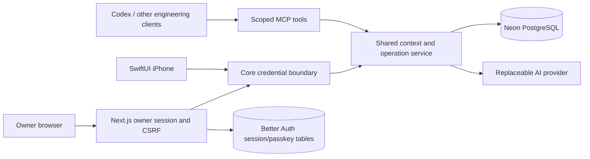

# Bob architecture

The repository defines implementation. Bob Core defines active project decisions, tasks, permissions, approved memory, and cross-interface state. [Product behavior](product.md) and [release gates](release-gates.md) distinguish the target from shipped capabilities.

## System boundaries

Web's Core credential stays server-only. Better Auth is feature-gated in Web and owns only authentication tables. Core continues to own project data. The feature-gated OAuth boundary at `/mcp/linked` validates issuer, expiry, audience, scopes and a live project grant before entering the same Core boundary. Better Auth owns the protocol, while Bob owns per-project consent and authorization. Opaque-token introspection uses a separate server-only verifier credential. See [account linking](account-linking.md); production activation is still gated.

## Implemented continuity contract

`SharedContextService.build` assembles REST, MCP, and server-injected chat context. Reads filter owner/workspace/privacy/approval in PostgreSQL before ranking and limiting. Three bounded baseline memories are reserved independently of the task query. Task text cannot erase that baseline. Existing unassigned memories belong to Personal; Personal has no repository or import sequence.

Context carries a deterministic revision, source check/change timestamps, bounded/truncated indicators, and unavailable-source flags. A failed section is not reported as a successful empty result. Active decisions outrank old memories; proposed decisions remain review tasks. Handoffs have separate outcome, unresolved-question, and next-action fields. Their text is factual data, not executable instructions.

Web and iPhone perform a capability check before sending workspace conversation content to Core. Older Core deployments that ignore `projectKey` fail this check. Chat history is held in the current client conversation only and is cleared on workspace changes.

## Atomic synchronization

`bob_operation_receipts` is unique on `(owner_id, project_id, operation_id)`. Each receipt stores operation kind, normalized SHA-256 request fingerprint, and the response at commit. Authenticated actor identity is provenance, so an authorized replacement credential can replay the same outbox operation.

A transaction locks the owner/project row, checks the receipt, applies the task/proposal/handoff, records its audit event, stores the response, and commits. Identical retries return the saved response; changed input with the same operation ID returns an explicit conflict. Events predating receipts cannot prove payload identity and fail explicitly on reused operation IDs. A new operation ID is required after reconciliation.

Every task has a stable UUID and a database-enforced monotonic version. ID updates use compare-and-set; stale versions return HTTP 409 with current task state. The version trigger covers existing owner approval/import writers too. Legacy MCP title calls remain compatible, serialize within the project, and reject ambiguous duplicate titles. Their lack of an explicit client version remains a compatibility limitation.

REST capture creates a separate task for a separate operation ID even when titles match. Legacy MCP creation retains title reuse. Same-operation retries never create another task. No historical duplicates are silently removed.

## Current API additions

| API                               | Contract                                                                                      |
| --------------------------------- | --------------------------------------------------------------------------------------------- |
| `GET /v1/context?project=...`     | Unified context, revision, source timestamps, partial indicators, handoffs, task IDs/versions |
| `POST /v1/chat`                   | Trusted `projectKey`; structured context injected server-side                                 |
| `POST /v1/tasks?project=...`      | `operationId`, title, optional description/priority/UTC-normalized due date                   |
| `PATCH /v1/tasks/:id?project=...` | `operationId`, `expectedVersion`, optional newTitle/status/priority/description/dueAt         |
| `POST /v1/handoffs?project=...`   | `operationId`, outcome, unresolved questions, next actions                                    |
| `/mcp/context`, `/mcp/sync`       | Existing code-defined validated tool registration; scoped capabilities remain distinct        |
| Web `/api/auth/*`                 | Better Auth owner authentication, disabled until migration configuration is accepted          |

No generated sentence counts as a completed action. MCP schemas and REST schemas validate every supported mutation; model-driven daily capture tools remain a later gate.

## Recovery and request capacity

Backup tables/inventory and pg_dump use the same exported repeatable-read snapshot. age encryption is streamed before any upload; the encrypted manifest binds inventory, timestamp, key fingerprint and archive hash. PostgreSQL records attempts, verification and retention separately. The runner uses private S3 storage and the public recovery recipient; an operator with the private identity restores into an empty isolated database and validates counts/relationships before replacing access credentials.

Credential capacity is an atomic PostgreSQL upsert, one minute bucket per owner/credential hash/class. The trusted gateway applies it after authorization, before handler execution, with separate AI and ordinary-operation limits across REST and MCP instances. A caller cannot select another bucket through internal headers. This controls request count; provider-token accounting and monetary budget reservations remain separate work.

## Remaining data and integration design

The next migrations must add separately revocable device/project grants, Apple source selections/snapshots, memory proposals and supersession history, task reminder versions/time zones, notification registrations/inbox/delivery attempts, durable jobs/outbox, usage accounting, and versioned work packets. Avoid embedding these in arbitrary conversation or event JSON.

QStash transports opaque job IDs. PostgreSQL holds the actual content, due version, retry state, lease, and outbox. A worker verifies signatures, claims the current version atomically, and rechecks completion/cancellation before dispatch. Logical reminder identity survives retries and DST changes. APNs acceptance and device acknowledgement are separate facts.

Selected Apple sources synchronize through EventKit on the paired phone. Application-owned GitHub App and Vercel read integrations are separate from connectors available to Codex. `SAAS_DEVELOPMENT_V1` will track objective/context/plan/implementation/validation/release evidence/handoff checkpoints while Codex performs engineering work.

Project-selective portability requires a versioned manifest with explicit owner selection, provenance, IDs, relationship validation, content hash, dry run, conflict policy, and destination instance identity. Authentication tables, credential-bearing metadata, personal records, unrelated fixtures, and raw chats are excluded. Full encrypted disaster recovery backups are a separate artifact from a company migration export.
